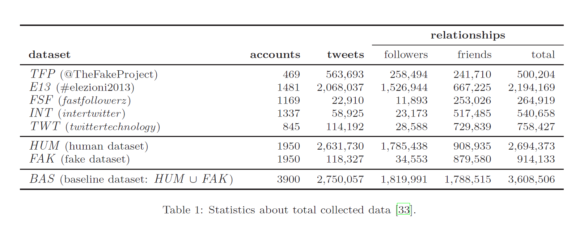

# BigDataProject3
Automatic detection of fake twitter followers

# Research paper summary

## The baseline datasets
- 9M accounts
- 3M tweets
  
### Fake project
Twitter account created to be followed by real accounts to collect data.
Referred as TFP  
  
### #Elezioni2013 dataset
Named E13, data mining of the twitter accounts involved in the #elezioni2013 and after discarding officially involved accounts and sampling the lefts ones, they manually checked the remaining accounts(1488).  
From this work resulted 1481 human accounts labeled.  
  
### Baseline dataset of human accounts
So TFP and E13 are the starting set of human accounts "HUM".  
  
### Baseline dataset of fake followers
3k fake accounts bought:  
    1169 FSF (fast followers)  
    1337 INT (intertwitter)  
    845 TWT (1000 but 155 got insta banned, from twittertechnology)  
  
Dataset is clearly illustrative and not exhaustive of all possible fake accounts.  

### Baseline dataset
Studies have shown that the distributions between classes in classification datasets can affect the classification.  
  
Twitter advanced that the amount of spam/fake accounts should be less then the 5% of MAU (monthly active users), not applicable for our problem because they cant be assimilated to out dataset and an account buying fake accounts, will have a abnormal distribution of fake/real accounts.   
--> <5% can't be transferred to fake followers of an account.  
  
They decided to go for a balanced distribution -> used 5%-95%(100 HUM - 1900 FAK)to 95%-5%(1900 HUM - 100 FAK) proportions to train the classifier, considering their accuracy with cross-validation.      

To obtain a balanced dataset, we randomly undersampled the total set of fake accounts (i.e., 3351) to match the size of the HUM dataset of verified human accounts. Thus, we built a baseline dataset of 1950 fake followers, labeled FAK. The final baseline dataset for this work includes both the HUM dataset and the FAK dataset for a total of 3900 Twitter accounts. This balanced dataset is labeled BAS in the remainder of the paper and has been exploited for all the experiments described in this work (where not otherwise specified). Table 1 shows the number of accounts, tweets and relationships contained in the datasets described in this section.

## Classifiers used for fake detection
From 3 procedures proposed, they assessed their effectiveness by trying them on their dataset. Depending on their efficiency, they will be used later as features to fit the classifiers.

### Followers of political candidates.
Test on Obama, Romney and Italian Politicians followers. Algorithm based on public features from the accounts. The algo assigns human and bot scores and classifies an account considering the gap between the sum of the two scores. The algo assigns a human point for each feature in the "feature table".  

On the other hand it receives a bot point when not meeting one of the features and 2 points for only using API.  
(specificities of each feature can be read in the paper)

### Stateofsearch.com
This website proposed the following rule set:  

This rule set doesn't focuses on the account but on the tweets emitted. The rules looking for similarities are done over the dataset.  
Important: because temporal isn't available and twitter's API limitation rule 6&7 were not applied.

### Socialbakers’ FakeFollowerCheck
Fakeness classification tool based on 8 criteria:  
